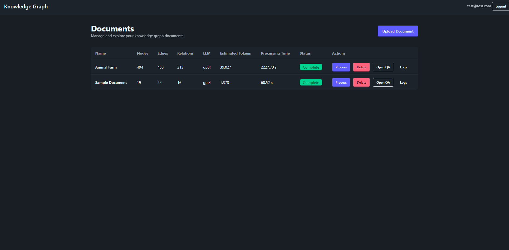
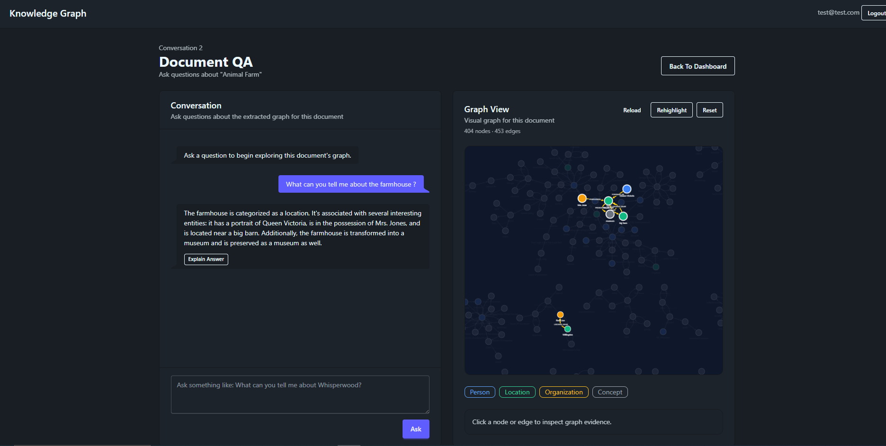
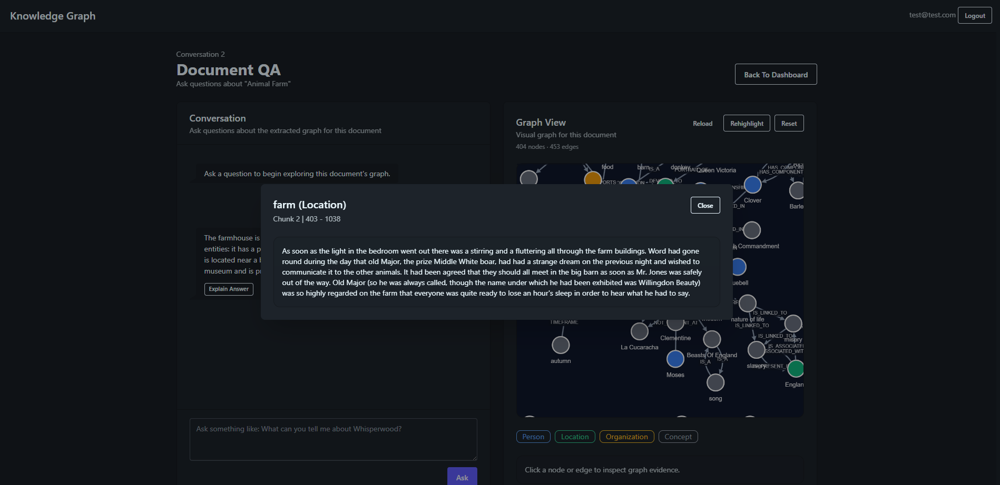
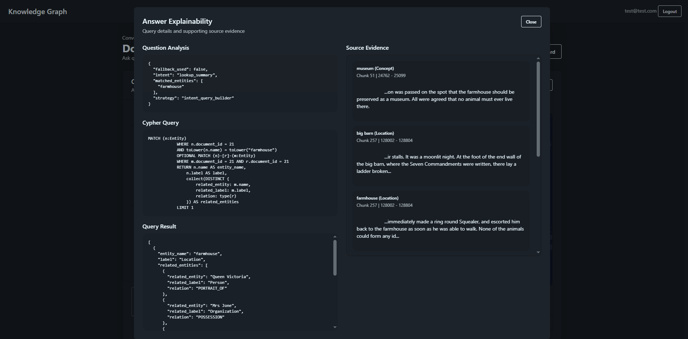

# Knowledge Graph QA System

A Django-based knowledge graph question-answering system that turns uploaded documents into graph data, stores that graph in Memgraph, and lets users ask natural-language questions with explainable results.

## What The Project Does

The system supports:

- document upload and asynchronous processing
- text extraction and normalization
- advanced chunking
- coreference-aware relation extraction
- entity normalization and label reconciliation
- graph generation and persistence
- graph-native QA over Memgraph
- explainability through Cypher, query rows, provenance, and question analysis
- graph exploration in the QA UI
- processing logs per document

## Tech Stack

- Django
- Celery
- Redis
- Memgraph
- PostgreSQL in Docker
- SQLite for local lightweight development
- HTMX
- Tailwind CSS
- Cytoscape.js
- WhiteNoise

---

## Environment Files

This project uses two environment-file patterns:

- `.env` for local development
- `.env.docker` for Docker runs

Example files are included in the repository:

- [.env.example](/F:/Projects/django/knowledge_graph/.env.example)
- [.env.docker.example](/F:/Projects/django/knowledge_graph/.env.docker.example)

### How To Use Them

For local development:

1. Copy `.env.example` to `.env`
2. Fill in the values you want to use locally

For Docker:

1. Copy `.env.docker.example` to `.env.docker`
2. Fill in the Docker-specific values

### What Goes In These Files

These files contain runtime configuration such as:

- Django secret key
- environment mode
- database selection
- PostgreSQL connection settings
- Redis host for Celery
- Memgraph host and port
- LLM provider settings
- OpenAI key if using OpenAI
- Ollama host and port if using local models
- allowed hosts
- Docker container names and exposed ports for the Docker setup

Do not commit your real `.env` or `.env.docker` files.

---

## Running With Docker

This is the easiest way to run the full stack.

### Services Started

`docker compose` starts:

- Django web app
- Celery worker
- PostgreSQL
- Redis
- Memgraph

### First-Time Setup

1. Create `.env.docker` from [.env.docker.example](/F:/Projects/django/knowledge_graph/.env.docker.example)
2. Fill in the values you want to use

### Start The Stack

```bash
docker compose --env-file .env.docker up --build
```

### Notes

- Migrations run automatically before the Django server starts.
- `collectstatic` also runs on startup so static assets work with `DEBUG=False`.
- The app will be available on the host port configured by `WEB_PORT` in `.env.docker`.
- If you use Ollama outside Docker, keep `OLLAMA_HOST=host.docker.internal` in `.env.docker` on Windows.

---

## Running Locally Without Docker

Local development uses:

- SQLite for Django data
- your locally running Redis instance
- your locally running Memgraph instance
- either OpenAI or a locally running Ollama instance

### Prerequisites

Make sure these are available on your machine:

- Python 3.12
- Node.js and npm
- Redis
- Memgraph

If you want to use local LLMs instead of OpenAI, also run Ollama locally.

### Local Setup

1. Create `.env` from [.env.example](/F:/Projects/django/knowledge_graph/.env.example)
2. Create and activate a Python virtual environment
3. Install Python dependencies
4. Install Tailwind dependencies
5. Run migrations

Example:

```bash
python -m venv env
env\Scripts\activate
pip install -r requirements.txt
cd theme\static_src
npm install
cd ..\..
python manage.py migrate
```

### Local Run Model

You need 3 terminals for the app itself:

#### Terminal 1: Tailwind

```bash
python manage.py tailwind start
```

#### Terminal 2: Celery

Activate the virtual environment first, then run:

```bash
celery -A knowledge_graph worker -l info -P solo
```

#### Terminal 3: Django

Activate the virtual environment first, then run:

```bash
python manage.py runserver
```

### Important Local Note

The three terminals above are for:

- Tailwind
- Celery
- Django

You still need Redis and Memgraph running locally as supporting services.

---

## LLM Setup

The project supports two main model setups:

### OpenAI

Set:

- `LLM_PROVIDER=OPENAI`
- `OPEN_AI_KEY=...`

### Ollama

Set:

- `LLM_PROVIDER=OLLAMA`
- `OLLAMA_HOST=...`
- `OLLAMA_PORT=...`

You can also keep the provider-specific model names in the env file.

---

## Key Features In The Current MVP

- advanced chunking
- coreference-aware relation extraction
- entity normalization and alias handling
- graph quality metrics
- QA intent routing
- saved QA conversations
- graph reload and highlighting on the QA page
- explainability through provenance, Cypher, query rows, and question analysis
- per-document processing logs
- Dockerized runtime

---

## Screenshots

Replace the placeholder links below with your final screenshots.

### Dashboard



### QA Page



### Node Provenance Modal



### Explainability Modal



---

## Project Structure

Important folders:

- [apps/auth_manager](/F:/Projects/django/knowledge_graph/apps/auth_manager)
- [apps/document_manager](/F:/Projects/django/knowledge_graph/apps/document_manager)
- [knowledge_graph](/F:/Projects/django/knowledge_graph/knowledge_graph)
- [theme/static_src](/F:/Projects/django/knowledge_graph/theme/static_src)
- [static](/F:/Projects/django/knowledge_graph/static)

Important files:

- [docker-compose.yml](/F:/Projects/django/knowledge_graph/docker-compose.yml)
- [Dockerfile](/F:/Projects/django/knowledge_graph/Dockerfile)
- [docker-entrypoint.sh](/F:/Projects/django/knowledge_graph/docker-entrypoint.sh)
- [project_context.md](/F:/Projects/django/knowledge_graph/project_context.md)

---

## Current Status

The project is now at a stage where the main end-to-end workflow is working:

- upload
- process
- build graph
- store graph
- query graph
- inspect evidence

The remaining work is mostly cleanup, polish, and test hardening rather than missing core functionality.
