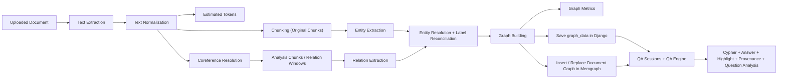

# Knowledge Graph QA System - Project Context

## Purpose

This document captures the current architecture, implemented capabilities, UI behavior, and remaining polish work for the Knowledge Graph QA System.

It is intended to help a developer or autonomous agent quickly understand:

- what the system currently does
- how ingestion and QA are organized
- how graph data is built, stored, and queried
- how explainability is implemented
- what operational and UX support exists
- what is still left as cleanup rather than foundational work

This reflects the project in its current implemented state.

---

# System Overview

This project is a Django-based knowledge graph question-answering platform built around:

- document ingestion
- text extraction and normalization
- chunking
- coreference-aware relation extraction
- entity normalization and label reconciliation
- graph generation
- graph persistence in Django and Memgraph
- natural language QA over the generated graph
- graph visualization and explainability in the UI

Users can:

- sign up and log in
- upload documents
- validate LLM availability before upload completes
- process documents asynchronously
- generate a graph from unstructured text
- store that graph both in `graph_data` and Memgraph
- open a dedicated QA page for a processed document
- choose an existing QA conversation or start a new one
- ask natural language questions against the document graph
- view and interact with the graph while querying it
- inspect provenance and question-analysis metadata
- review or download per-document processing logs

The overall workflow is:

Document
-> Text processing
-> Coreference-aware extraction
-> Entity normalization
-> Graph generation
-> Graph storage
-> Cypher-based QA + grounded answer generation

---

# Technology Stack

## Backend

- Python
- Django
- PostgreSQL in the containerized runtime
- SQLite for lightweight local development

## Frontend

- Jinja templates via `django-jinja`
- HTMX
- Alpine.js
- Tailwind CSS
- DaisyUI
- Cytoscape.js for graph visualization

## Graph Database

- Memgraph
- Cypher
- `gqlalchemy`

## AI / NLP Layer

- OpenAI-backed extraction and QA
- Ollama-backed local extraction and QA
- `fastcoref` for coreference resolution
- `RapidFuzz` and deterministic matching for normalization

## Background Processing

- Celery
- Redis

## Containerized Runtime

- Docker
- Docker Compose
- WhiteNoise for static asset serving in Docker with `DEBUG=False`

---

# Project Structure

All Django apps live under `apps/`.

Primary apps:

- `apps/auth_manager`
- `apps/document_manager`

Most implementation work currently lives in `document_manager`, including:

- routes and views
- upload and processing flow
- graph-building pipeline
- graph database integration
- QA engine
- dashboard and QA templates

Service modules are organized by concern, including:

- `services/extraction`
- `services/coreference`
- `services/normalization`
- `services/chunking`
- `services/entity_extraction`
- `services/relation_extraction`
- `services/graph_building`
- `services/qa`

---

# Authentication

The `auth_manager` app handles:

- signup
- login
- logout
- session-backed authentication

The project uses a custom email-based user model.

---

# Document Manager

The `document_manager` app is the core application layer.

Responsibilities include:

- document upload
- document ownership and storage
- process-state tracking
- asynchronous ingestion
- graph generation and persistence
- QA over the generated graph
- graph-aware QA UI
- saved QA conversations
- processing-log visibility

Documents are scoped to users at the application layer.

---

# Core Models

## `Document`

Important fields include:

- `user`
- `name`
- `file`
- `llm_used`
- `status`
- `progress`
- `nodes`
- `edges`
- `relations`
- `estimated_tokens`
- `processing_time`
- `error_message`
- `graph_data`
- `created_at`

`graph_data` is the Django-side serialized graph and also drives the QA graph viewer.

## `ProcessingLog`

Pipeline progress is tracked through `ProcessingLog`.

Each log stores:

- `document`
- `stage`
- `message`
- `created_at`

This supports debugging and user-visible traceability for document processing.

## `QASession`

Represents one saved conversation thread for a document.

Important fields include:

- `document`
- `user`
- `title`
- `created_at`
- `updated_at`

## `QAMessage`

Represents one user or assistant turn in a QA session.

Important fields include:

- `session`
- `role`
- `content`
- `cypher`
- `query_rows`
- `provenance`
- `highlight`
- `question_analysis`
- `created_at`

This allows the system to retain both answer content and explainability artifacts.

---

# Frontend Architecture

The frontend is server-rendered and HTMX-enhanced.

Current UI surfaces include:

- dashboard
- upload modal
- document table
- processing log page
- QA session picker
- dedicated QA page

## Dashboard

The dashboard currently supports:

- listing uploaded documents
- showing node, edge, and relation counts
- showing estimated token counts
- showing process status and processing percentage
- starting document processing
- deleting documents
- opening QA for processed documents
- opening a processing-log page

The document table has been widened and made horizontally scrollable so action buttons remain usable as more metadata columns were added.

## Processing Logs UI

The logs flow now supports:

- opening a dedicated log page per document
- viewing timestamp / stage / message rows
- downloading logs as plain text

## QA Session Picker

The QA flow includes a session picker page per document.

This page supports:

- listing previous conversations
- creating a new conversation
- reopening older saved conversations

## Dedicated QA Page

The QA experience lives on a dedicated page per document.

Current layout:

- left panel: chat-style QA thread
- right panel: graph viewer

The left side supports:

- entering questions
- rendering answers
- showing generated Cypher
- showing raw query rows
- showing provenance
- showing question-analysis metadata

The right side supports:

- rendering the graph with Cytoscape.js
- reloading the graph panel independently with HTMX
- resetting the graph viewport
- rehighlighting the most recent QA selection
- highlighting relevant nodes and edges from QA output
- clicking nodes and edges to inspect provenance

The graph header has been compacted so graph actions and graph metadata fit more cleanly.

---

# Current User Flow

## Upload Flow

User opens upload modal
-> User submits document form
-> Django validates selected LLM availability
-> Django stores file and metadata
-> Dashboard refreshes document list

## Processing Flow

User clicks Process
-> Django marks document as processing
-> Celery task starts
-> Text is extracted and normalized
-> Estimated tokens are computed
-> Text is chunked
-> Coreference resolution is applied
-> Entities are extracted from original chunks
-> Relations are extracted from coreference-aware analysis chunks
-> Entities are normalized and labels reconciled
-> Graph is built
-> Chunk and graph metrics are computed/logged
-> Graph is saved to `graph_data`
-> Existing graph for that document is removed from Memgraph
-> Fresh nodes and edges for that document are inserted into Memgraph
-> Document status becomes complete

## QA Flow

User opens the QA session picker
-> User chooses an existing conversation or starts a new one
-> User asks a natural language question
-> QA engine builds graph schema context from `graph_data`
-> Supported intents are routed to deterministic Cypher
-> Other questions fall back to LLM-generated Cypher
-> Cypher is validated as read-only
-> Query executes against Memgraph
-> Query can be repaired if execution fails
-> Result rows are turned into a grounded natural-language answer
-> Highlight payload and provenance payload are built
-> Question-analysis metadata is stored
-> Answer and explainability artifacts are saved to the session
-> Graph highlights the relevant subgraph

---

# Processing Pipeline

The ingestion pipeline is:

Document Upload
-> Text Extraction
-> Text Normalization
-> Token Estimation
-> Coreference Resolution
-> Text Chunking
-> Entity Extraction on original chunks
-> Relation Extraction on analysis chunks / adjacent windows
-> Entity Resolution and Label Reconciliation
-> Graph Building
-> Graph Metrics
-> Save Graph Data to Django
-> Insert Graph into Memgraph

## Pipeline Diagram

---

# Text Extraction And Normalization

The system supports extracting text from:

- pdf
- txt
- md

Normalization currently includes:

- Unicode normalization
- whitespace cleanup
- blank-line cleanup
- cleanup of common PDF line-break artifacts

The normalized text is also used to compute a rough token estimate for dashboard visibility.

---

# Chunking

The system now supports multiple chunking strategies, including a more advanced recursive option.

Chunk objects include:

- `chunk_id`
- `document_id`
- `text`
- `start_index`
- `end_index`
- `analysis_text`
- `source_chunk_ids`

`text` is preserved for provenance.

`analysis_text` allows downstream relation extraction to use coreference-aware text while keeping original evidence intact.

`source_chunk_ids` tracks which original chunks contributed to a larger relation-analysis window.

## Chunk Metrics

The pipeline computes chunk metrics to make preprocessing quality more observable.

These metrics are returned with processing results and support later tuning.

---

# Coreference Resolution

The project includes a dedicated coreference stage under `services/coreference`.

Current implementation supports:

- `noop` resolver
- `fastcoref` resolver

Current output includes:

- `original_text`
- `resolved_text`
- `clusters`

Current design:

- entity extraction runs on original chunk text
- relation extraction can use resolved `analysis_text`
- provenance remains tied to original chunk text

This improves relation recall without weakening evidence fidelity.

---

# Entity Extraction

Entity extraction uses a factory-based design.

Current extractor options:

- heuristic extractor
- LLM extractor

The LLM extractor supports:

- OpenAI-backed extraction
- Ollama-backed extraction

Entity output is normalized into a consistent structure including:

- `label`
- `name`
- `document_id`
- `chunk_id`
- `start_index`
- `end_index`
- `source_text`

---

# Relation Extraction

Relation extraction follows the same pattern.

Current extractor options:

- heuristic extractor
- LLM extractor

Current relation behavior includes:

- use of `analysis_text` when available
- adjacent-chunk relation windows
- endpoint repair against known chunk entities
- post-resolution self-loop protection

Relation output includes:

- `source`
- `source_label`
- `target`
- `target_label`
- `type`
- `document_id`
- `chunk_id`
- `start_index`
- `end_index`
- `source_text`

---

# Entity Normalization And Label Reconciliation

The project includes a dedicated entity resolution stage between extraction and graph building.

Current normalization behavior includes:

- scoring-based matching
- `inflect`-based singularization
- `RapidFuzz` similarity
- token overlap and surface normalization
- cross-label cluster merging for strong matches
- canonical name selection
- canonical label selection using counts plus tie-breaking
- label-count summaries
- alias collection
- heuristic person-alias handling

This stage reduces duplicate graph nodes caused by:

- singular/plural variation
- light lexical variation
- abbreviated or shortened mentions
- label disagreement across chunks

This area is working well enough for MVP, but remains an important tuning surface for broader document types.

---

# Graph Building

After extraction and normalization, entities and relations are converted into an in-memory graph representation.

The graph builder currently:

- deduplicates nodes
- deduplicates edges
- assigns stable node ids
- uses canonical names and labels
- preserves provenance metadata
- stores aliases
- stores label-count metadata
- skips same-node edges

The resulting graph is stored in `document.graph_data`.

---

# Graph Persistence

Graph data is persisted in two places.

## Django Database

The serialized graph is stored in `Document.graph_data`.

Summary values are also stored on the document:

- `nodes`
- `edges`
- `relations`

## Memgraph

The graph is also inserted into Memgraph.

Current Memgraph conventions:

- all nodes use `:Entity`
- semantic type is stored in node property `label`
- stable UI-aligned ids are stored in node property `graph_id`
- relationships use typed edges
- nodes and edges are scoped by `document_id`

The intended replacement behavior is document-scoped:

- delete the current document's existing graph from Memgraph
- insert the regenerated graph for that document
- leave other documents untouched

The global graph clear setting is disabled in normal operation.

---

# Graph Database Layer

The graph database service is responsible for:

- creating the Memgraph connection
- deleting the existing graph for one document
- creating nodes
- creating edges
- executing read queries for QA
- persisting `graph_id` for graph/UI alignment

This layer is the bridge between the processing pipeline and QA.

---

# Graph Quality Metrics

The processing pipeline now computes graph quality metrics after graph construction.

Current metrics include:

- `node_count`
- `edge_count`
- `isolated_nodes`
- `connected_components`
- `largest_component_size`
- `average_degree`
- `density`

These metrics are logged during processing and help evaluate the effect of chunking, coreference, and normalization changes.

---

# QA Engine

The QA engine is implemented and working.

It is responsible for:

- building schema context from `graph_data`
- generating Cypher from natural language questions
- validating that Cypher is read-only
- executing queries against Memgraph
- repairing Cypher if execution fails
- generating grounded natural-language answers
- building graph highlight payloads
- building provenance payloads
- storing QA outputs in saved sessions

## QA Design Principles

The QA layer currently follows these rules:

- every query is scoped to one document
- only read-only Cypher is allowed
- dangerous Cypher operations are blocked
- prompts use the actual graph schema
- answers remain grounded in graph results
- explanations stay traceable to graph evidence

## QA Intent Layer

The QA system includes an initial intent-routing layer before generic LLM Cypher generation.

Currently supported intent families:

- `lookup_basic`
- `lookup_summary`
- `relationship_path`
- `ranking_centrality`
- `ranking_influence`

Current examples of supported questions:

- `Who/what is X?`
- `What can you tell me about X?`
- `How is X related to Y?`
- `Who is central in the document?`
- `Who is most influential?`

`ranking_influence` is currently implemented as incoming edge count plus outgoing edge count.

The current intent layer is considered sufficient for MVP while remaining structured enough to expand later.

## Question Analysis

Assistant QA turns now store question-analysis metadata alongside:

- Cypher
- query rows
- provenance
- highlight payload

Question analysis captures:

- detected intent
- matched entities
- query strategy
- whether fallback was used
- intent-specific filters

This metadata is shown in the explainability UI.

---

# Graph Viewer And Explainability

The dedicated QA page includes a Cytoscape.js graph viewer.

Current capabilities:

- render nodes and edges from `document.graph_data`
- color nodes by entity type
- display relation labels
- reload the graph panel independently through HTMX
- reapply the most recent highlight after graph reload
- highlight relevant nodes and edges after QA
- fade non-relevant graph elements during focus
- zoom to the focused subgraph
- inspect provenance by clicking nodes and edges

The graph UI is split into:

- a reusable graph panel partial
- a reload-safe graph script partial

This allows the graph to refresh independently without reloading the whole QA page.

## Explainability

The system includes a practical explainability stack:

- provenance on nodes and edges
- Cypher shown for QA answers
- raw query rows shown for QA answers
- question-analysis metadata shown for QA answers
- graph evidence modals for clicked nodes and edges
- saved highlight payloads for assistant turns
- downloadable processing logs for pipeline visibility

This gives the project a strong answer-grounding and pipeline-traceability story.

---

# Containerized Runtime

The project now supports a Docker-based developer workflow.

Current setup includes:

- Django web app
- Celery worker
- PostgreSQL
- Redis
- Memgraph

Current runtime behavior:

- environment-driven settings for SQLite locally or PostgreSQL in Docker
- startup via `docker compose`
- migration execution before the Django server starts
- `collectstatic` during container startup
- WhiteNoise serving static assets with `DEBUG=False`
- Docker-specific environment variables for database, Redis, Memgraph, and Ollama

This makes the project easier to run, demo, and share.

---

# Testing Direction

The testing strategy is still growing.

Current priorities include:

- pipeline completion and document field updates
- processing log creation
- coreference-aware relation extraction
- entity resolution and label reconciliation
- graph generation correctness
- QA query generation and repair
- provenance and highlight payload generation
- QA session persistence and reload behavior

---

# Current Strengths

The project now has a strong vertical slice across ingestion, graph creation, QA, UI, and operational support.

Implemented strengths include:

- modular pipeline design
- pluggable extractor and factory pattern
- heuristic and LLM extraction support
- dedicated coreference stage
- advanced chunking with analysis-text support
- graph serialization in Django
- document-scoped Memgraph persistence
- graph quality metrics
- natural-language QA over the graph
- Cypher safety validation and repair
- saved QA conversations
- intent-aware QA routing
- provenance-aware answer evidence
- question-analysis explainability
- graph highlighting tied to QA output
- reloadable QA graph panel
- processing log UI and log download
- estimated-token visibility on the dashboard
- Docker Compose based runtime with Postgres and WhiteNoise-backed static serving

---

# Current Limitations

Important current limitations include:

- extraction quality still depends heavily on document style and chunk quality
- heuristic extraction remains brittle across very different domains
- LLM extraction can still miss or distort graph structure
- normalization and person-alias handling are still heuristic
- coreference remains difficult for dialogue-heavy or pronoun-heavy text
- relation density still depends strongly on local chunk context
- empty or weak QA results do not yet have a richer recovery path
- path-highlighting correctness depends on persisted `graph_id` values
- graph-panel interactions can still be polished further
- tests still need expansion and stabilization

---

# Current Completion State

The project now already demonstrates the intended end-to-end Graph-RAG story:

- ingestion
- preprocessing
- graph construction
- graph persistence
- graph-native QA
- explainability
- interactive UI
- operational thinking

Previously planned milestone items that are now implemented:

- advanced chunking
- initial QA intent routing
- graph quality metrics
- Dockerized developer experience

The remaining work is now mostly cleanup, polish, and test hardening rather than missing foundational capability.

## Remaining Finish-Line Work

Reasonable completion work from here includes:

- UI cleanup and consistency polishing
- stronger automated tests
- better recovery for weak or empty QA results
- broader normalization tuning on more varied corpora
- documentation cleanup and demo readiness

---

# Long-Term Goals

The long-term goal is to build a lightweight but capable platform for:

- ingesting unstructured documents
- transforming them into knowledge graphs
- normalizing and linking graph entities more intelligently
- storing and querying those graphs efficiently
- answering natural language questions over graph structure
- visually exploring the graph while asking questions
- showing evidence and provenance behind answers
- demonstrating practical Graph-RAG architecture patterns

The project is also intended to serve as a hands-on system for learning and demonstrating:

- knowledge graph engineering
- graph database integration
- LLM pipeline design
- prompt engineering for structured extraction
- question answering over symbolic graph data
- graph-aware application UI design
- explainability and provenance design
- modular Django application architecture
