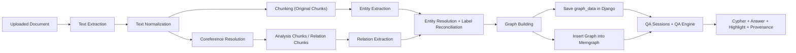

# Knowledge Graph QA System - Project Context

## Purpose of this Document

This document describes the current architecture, implemented modules, UI behavior, and near-term direction of the Knowledge Graph QA System.

The goal is to help a developer or autonomous agent understand:

- what the system currently does
- how the main Django apps and service layers are organized
- how the ingestion pipeline works end to end
- how graph data is stored, normalized, and queried
- how the QA layer currently operates
- how the current UI and graph interaction work
- what the key limitations and next steps are

This document reflects the project as it is currently implemented.

---

# System Overview

This project is a Django-based knowledge graph question-answering platform built around:

- document ingestion
- entity and relation extraction
- coreference resolution
- entity normalization
- graph generation
- graph persistence in Django and Memgraph
- natural language question answering over the generated graph
- visual graph exploration during QA

Users can:

- sign up and log in
- upload documents
- validate LLM availability before upload completes
- process documents asynchronously
- generate a graph from unstructured text
- store that graph both in `graph_data` and Memgraph
- open a dedicated QA page for a processed document
- choose an existing QA conversation or start a new one
- ask natural language questions against that document graph
- view and interact with the graph while querying it
- inspect provenance for graph elements and QA evidence

The overall architecture follows a Graph-RAG style workflow:

Document  
-> Text processing  
-> Coreference resolution  
-> Entity and relation extraction  
-> Entity normalization  
-> Graph generation  
-> Graph storage  
-> Natural language question answering via Cypher + LLM

---

# Technology Stack

## Backend

- Python
- Django

## Frontend

- Jinja templates via `django-jinja`
- HTMX
- Alpine.js
- Tailwind CSS
- DaisyUI
- Cytoscape.js for graph visualization
- Mermaid for lightweight architecture / pipeline diagrams in documentation

## Graph Database

- Memgraph
- Cypher query language
- `gqlalchemy` for database interaction

## AI Layer

Currently supported LLM choices in the app:

- OpenAI-backed GPT-style extraction and QA
- local Llama via Ollama

## Background Processing

- Celery
- Redis as broker/result backend

## Specialized NLP / Matching Direction

The project is beginning to move toward more generalized normalization using scoring-based matching rather than only hardcoded heuristics.

This normalization direction is intended to rely primarily on deterministic NLP / string matching techniques rather than heavy LLM usage.

---

# Project Structure

All Django apps are under `apps/`.

Primary apps:

- `apps/auth_manager`
- `apps/document_manager`

The main implementation currently lives in `document_manager`, which contains:

- routes and views
- upload and processing flow
- ingestion pipeline services
- graph building
- graph database integration
- QA engine
- UI templates for dashboard and QA

Service modules are organized by responsibility, including:

- `services/extraction`
- `services/coreference`
- `services/normalization`
- `services/chunking`
- `services/entity_extraction`
- `services/relation_extraction`
- `services/graph_building`
- `services/qa`

---

# Authentication System

The `auth_manager` app handles authentication.

Responsibilities:

- user signup
- user login
- user logout
- session-backed authentication views and templates

The project uses a custom user model based on email login.

---

# Document Manager

The `document_manager` app is the core application.

Responsibilities include:

- document upload
- document ownership and storage
- process-state tracking
- asynchronous ingestion
- graph generation
- graph persistence
- question answering over the generated graph
- graph-aware QA UI
- saved QA conversation management

Documents are scoped to users at the application layer, so each user sees only their own uploaded documents.

---

# Document Model

Each uploaded document is stored in the database.

Important fields include:

- `user` - owner of the document
- `name` - document name
- `file` - uploaded file
- `llm_used` - chosen LLM option
- `status` - pending / processing / complete / error
- `nodes` - total number of graph nodes generated
- `edges` - total number of graph edges generated
- `relations` - count of distinct relation types
- `processing_time` - total processing time in seconds
- `error_message` - failure message if processing fails
- `graph_data` - JSON representation of the generated graph
- `created_at` - upload timestamp

The `graph_data` field acts as the Django-side serialized version of the document graph and is also used to drive the graph viewer on the QA page.

---

# QA Session Models

The project now stores QA conversations in the database.

## `QASession`

Represents one saved conversation thread for a document.

Important fields include:

- `document`
- `user`
- `title`
- `created_at`
- `updated_at`

## `QAMessage`

Represents one user or assistant turn inside a QA session.

Important fields include:

- `session`
- `role`
- `content`
- `cypher`
- `query_rows`
- `provenance`
- `highlight`
- `created_at`

This allows the system to:

- resume past conversations
- audit generated Cypher and result rows
- keep graph highlighting metadata tied to each assistant turn

---

# Processing Log Model

Pipeline progress is tracked using `ProcessingLog`.

Each log entry stores:

- document reference
- pipeline stage
- message
- timestamp

Typical stages include:

- START
- TEXT_EXTRACTION
- NORMALIZATION
- COREFERENCE
- CHUNKING
- ENTITY_EXTRACTION
- RELATION_EXTRACTION
- ENTITY_RESOLUTION
- GRAPH_BUILDING
- GRAPH_DATABASE
- COMPLETE
- ERROR

These logs help debug asynchronous document processing.

---

# Frontend Architecture

The frontend is server-rendered and HTMX-enhanced.

Current UI surfaces include:

- dashboard
- upload modal
- document table
- QA session picker
- dedicated QA page

## Dashboard

The dashboard currently supports:

- listing uploaded documents
- showing node/edge/relation counts
- showing process status
- showing processing percentage
- starting document processing
- deleting documents
- opening a dedicated QA page for a selected document

The upload modal now also performs validation to ensure the selected LLM is available before a document is accepted.

## QA Session Picker

The QA flow now includes a session picker page per document.

This page supports:

- listing previous conversations for a document
- creating a new conversation
- reopening an older saved conversation

## Dedicated QA Page

The QA experience lives on a dedicated page per document.

Current layout:

- left panel: chat-style QA thread
- right panel: graph viewer and graph evidence panel

The left side is the primary interaction surface for:

- entering questions
- showing answer messages
- showing generated Cypher
- showing raw query results
- showing source evidence used by the answer

The right side currently supports:

- rendering the graph with Cytoscape.js
- resetting the graph viewport
- highlighting relevant nodes and edges based on QA output
- selecting graph elements directly
- viewing provenance for clicked nodes and edges

This creates a stronger document-specific QA experience than placing QA directly on the dashboard.

---

# Current User Flow

## Upload Flow

The upload flow works as follows:

User opens upload modal  
-> User submits document form  
-> Django validates selected LLM availability  
-> Django stores file and metadata  
-> Dashboard refreshes document list

## Processing Flow

The processing flow works as follows:

User clicks Process  
-> Django marks document as processing  
-> Document progress starts from 0 and updates during pipeline execution  
-> Celery task starts  
-> Text is extracted and normalized  
-> Coreference resolution is applied to document text  
-> Text is chunked  
-> Entities are extracted from original chunks  
-> Relations are extracted using coreference-aware analysis text  
-> Entities are normalized and labels reconciled across mentions  
-> Graph is built  
-> Graph is saved to `graph_data`  
-> Counts are updated on the `Document` model  
-> Graph is inserted into Memgraph  
-> Document status becomes complete

## QA Flow

The QA flow currently works as follows:

User opens the QA session picker for a document  
-> User chooses an existing conversation or starts a new one  
-> User opens the QA page for that session  
-> User asks a natural language question  
-> QA engine builds graph schema context from `graph_data`  
-> LLM generates a read-only Cypher query  
-> Cypher is validated for safety  
-> Query is executed against Memgraph  
-> If execution fails, a repair prompt generates corrected Cypher  
-> Result rows are converted into a natural-language answer  
-> Highlight payload is built from the result rows  
-> Provenance payload is built from the highlighted graph elements  
-> The answer is appended to the chat thread  
-> The graph highlights the relevant subgraph  
-> Source evidence is shown in the QA response and is also inspectable from graph clicks
-> The user and assistant turns are saved to the QA session for future retrieval

---

# Document Processing Pipeline

The current ingestion pipeline is:

Document Upload  
-> Text Extraction  
-> Text Normalization  
-> Coreference Resolution  
-> Text Chunking  
-> Entity Extraction on original chunk text  
-> Relation Extraction on coreference-aware analysis text  
-> Entity Resolution / Label Reconciliation  
-> Graph Building  
-> Save Graph Data to Django  
-> Insert Graph into Memgraph

This pipeline is implemented as a set of service modules.

## Pipeline Diagram



---

# Text Extraction

The system supports extracting text from:

- pdf
- txt
- md

Extraction is implemented through a factory-based extractor system.

Current extractor pattern:

- base extractor interface
- extension-based factory selection
- extractor implementation per file type

This keeps extraction modular and easy to extend.

---

# Text Normalization

Extracted text is normalized before chunking.

Normalization currently includes:

- Unicode normalization
- whitespace cleanup
- blank-line cleanup
- fixing common PDF line-break artifacts

The goal is to make chunking and extraction more stable.

---

# Text Chunking

Normalized text is split into chunks before extraction.

Currently implemented chunking strategies:

- word
- sentence
- paragraph

The strategy is controlled through Django settings.

Chunk objects include:

- `chunk_id`
- `document_id`
- `text`
- `start_index`
- `end_index`
- `analysis_text` (optional)
- `source_chunk_ids` (optional)

`text` is the original chunk text used for provenance.

`analysis_text` is an optional alternate text used for downstream analysis, such as coreference-aware relation extraction, while preserving original source evidence.

`source_chunk_ids` is used when a relation-analysis window combines adjacent chunks, allowing the system to keep track of which original chunks contributed to a broader relation context.

This metadata is carried forward into extraction results.

---

# Coreference Resolution

The project now includes a dedicated coreference stage in the processing pipeline.

Current implementation:

- factory-based resolver structure under `services/coreference`
- configurable resolver selection via Django settings
- `noop` resolver for no-op behavior
- `fastcoref` resolver for ML-based coreference resolution

The current coreference output shape includes:

- `original_text`
- `resolved_text`
- `clusters`

Coreference is currently used primarily to improve relation extraction rather than entity extraction.

Current design choice:

- entity extraction runs on the original chunk text
- relation extraction can run on `analysis_text`, which is derived from the coreference-resolved document text
- relation extraction can operate on chunk-local or adjacent-chunk analysis windows
- provenance remains tied to original chunk text

This design improves relation recall while keeping source evidence more faithful to the original document.

---

# Entity Extraction

Entity extraction is implemented using a factory-based design.

Current extractor options:

- heuristic extractor
- LLM extractor

## Heuristic Entity Extraction

The heuristic extractor uses hand-written rules and pattern matching.

Characteristics:

- fast
- cheap
- easy to debug
- domain-sensitive
- less flexible across very different document styles

## LLM Entity Extraction

The LLM extractor supports:

- OpenAI-backed extraction
- local Llama extraction through Ollama

The LLM extractor:

- prompts the model for structured JSON
- parses JSON safely
- normalizes extracted entities
- deduplicates repeated entities

Entity output is normalized into a consistent internal structure including:

- `label`
- `name`
- `document_id`
- `chunk_id`
- `start_index`
- `end_index`
- `source_text`

---

# Relation Extraction

Relation extraction follows the same pattern as entity extraction.

Current extractor options:

- heuristic extractor
- LLM extractor

## Heuristic Relation Extraction

The heuristic relation extractor uses explicit phrase-based rules.

Characteristics:

- simple baseline
- easy to reason about
- best suited for predictable text
- weaker across highly varied domains

## LLM Relation Extraction

The LLM relation extractor supports:

- OpenAI-backed relation extraction
- local Llama relation extraction through Ollama

The LLM is given:

- the chunk text
- the entities already identified in that chunk

It returns structured JSON relations, which are then normalized into a consistent relation shape.

Relation output includes:

- `source`
- `source_label`
- `target`
- `target_label`
- `type`
- `document_id`
- `chunk_id`
- `start_index`
- `end_index`
- `source_text`

The relation extraction stage now supports using a chunk's `analysis_text` when available, while still preserving the original `text` as provenance.

The current direction also includes:

- broader heuristic relation coverage
- improved LLM relation prompts for multi-sentence local context
- endpoint repair so near-match entity names from the LLM are mapped back to known chunk entities instead of being dropped

---

# Entity Normalization And Label Reconciliation

The project now includes a dedicated entity resolution stage between extraction and graph building.

The motivation is to reduce duplicate graph nodes caused by surface-form variation, such as:

- singular vs plural forms
- simple lexical variants
- lightly different surface mentions referring to the same concept
- the same entity being assigned different labels across chunks

Current normalization / resolution behavior:

- scoring-based matching using deterministic NLP / string similarity
- `inflect`-based singularization support
- `RapidFuzz` string similarity
- token overlap and surface normalization
- cross-label cluster merging for strong matches
- canonical name selection
- canonical label selection using majority counts plus priority tie-breaks
- per-entity label count summaries
- alias collection across merged mentions

The current label reconciliation behavior is intended to handle cases where one surface name may be identified as multiple types, for example:

- `Moonkeep` as both `Person` and `Organization`

In those cases, the resolver now:

- merges strong name matches across labels
- counts observed labels in the merged cluster
- selects a canonical label
- rewrites entities and relations to use the canonical name and canonical label
- stores known aliases for the canonical entity

The resolver also produces a label summary dictionary per canonical entity, for example:

```json
{
  "Moonkeep": {
    "Organization": 4,
    "Location": 0,
    "Person": 1,
    "Concept": 0
  }
}
```

This stage is especially important for concept-like entities, where duplicate isolated nodes can otherwise degrade graph quality and QA quality.

---

# Graph Building

After extraction and normalization, entities and relations are converted into an in-memory graph representation.

The graph builder currently:

- deduplicates nodes
- deduplicates edges
- assigns a stable node id shape
- uses canonical names and canonical labels after resolution
- preserves provenance metadata
- stores original names where useful
- stores aliases on graph nodes
- stores label count metadata on nodes
- produces node and edge collections
- computes graph counts

The resulting graph structure looks like:

```json
{
  "nodes": [
    {
      "id": "3:Location:Whisperwood",
      "name": "Whisperwood",
      "original_name": "Whisperwood",
      "aliases": ["Whisperwood", "the Whisperwood"],
      "label": "Location",
      "label_counts": {
        "Organization": 0,
        "Location": 3,
        "Person": 0,
        "Concept": 0
      },
      "document_id": 3,
      "provenance": {
        "chunk_id": 0,
        "start_index": 0,
        "end_index": 120,
        "source_text": "Elarin lives in Whisperwood near the old pines."
      }
    }
  ],
  "edges": [
    {
      "id": "3:Person:Elarin-LIVES_IN-3:Location:Whisperwood",
      "source": "3:Person:Elarin",
      "target": "3:Location:Whisperwood",
      "source_name": "Elarin",
      "target_name": "Whisperwood",
      "type": "LIVES_IN",
      "document_id": 3,
      "provenance": {
        "chunk_id": 0,
        "start_index": 0,
        "end_index": 120,
        "source_text": "Elarin lives in Whisperwood near the old pines."
      }
    }
  ],
  "counts": {
    "nodes": 10,
    "edges": 14,
    "relation_types": 4
  }
}
```

This structure is stored in `document.graph_data`.

---

# Graph Persistence

Graph data is persisted in two places.

## Django Database

The serialized graph is stored in `Document.graph_data`.

Additional summary values are also stored:

- `nodes`
- `edges`
- `relations`

This gives the app a quick summary view of processing results and also supplies the data needed for the graph viewer.

## Memgraph

The graph is also inserted into Memgraph.

Current graph conventions in Memgraph:

- all nodes use label `:Entity`
- semantic type is stored in node property `label`
- relationships use typed edges such as `WORKS_AT`, `LIVES_IN`, `ALLY_OF`, etc.
- both nodes and edges are scoped using `document_id`

The graph insertion service can also clear the graph database before insertion if configured to do so, though that behavior is primarily useful during development and should be used carefully.

---

# Graph Database Layer

The graph database service handles Memgraph interaction.

Current responsibilities:

- create Memgraph connection
- optionally clear database
- delete existing graph for a single document
- create nodes
- create edges
- execute read queries for QA

This service is the bridge between the ingestion pipeline and the QA layer.

---

# QA Engine

The QA engine is implemented and working.

It is responsible for:

- building a schema summary from the document graph
- generating a Cypher query from a natural language question
- validating that the generated query is read-only
- executing the query against Memgraph
- repairing Cypher if execution fails
- generating a natural-language answer from result rows
- building graph highlight payloads from query results
- building provenance payloads from highlighted graph elements
- operating within saved QA sessions through the view layer

## QA Design Principles

The QA layer currently follows these rules:

- every query must be scoped to one document
- only read-only Cypher is allowed
- dangerous Cypher operations are blocked
- prompts use actual graph schema instead of hardcoded domain assumptions
- name matching prefers case-insensitive Cypher patterns
- answer generation is phrased naturally but remains grounded in the graph result
- explanations should remain traceable back to graph evidence

## Cypher Repair

If generated Cypher fails to execute, the system performs a repair step.

The repair flow is:

Original question  
-> Generated Cypher  
-> Memgraph error  
-> Repair prompt with bad query + error message  
-> Corrected Cypher  
-> Query execution retry

This improves robustness against common LLM query mistakes.

---

# Graph Viewer

The dedicated QA page includes a graph viewer built with Cytoscape.js.

Current capabilities:

- render nodes and edges from `document.graph_data`
- color nodes by entity type
- display relation labels on edges
- reset the graph view with a dedicated button
- show a legend for the current entity color mapping
- highlight relevant nodes and edges after a QA response
- fade non-relevant graph elements during answer focus
- zoom to the relevant subgraph when highlighting is applied
- allow clicking nodes and edges to inspect provenance
- preserve graph interaction while reloading saved conversations

The graph panel is now an interactive companion to the QA thread rather than a passive visualization.

---

# Explainability And Provenance

The system now includes a first provenance layer.

Current provenance behavior:

- entities retain chunk-level origin data
- relations retain chunk-level origin data
- graph nodes and edges store provenance in `graph_data`
- QA answers surface source evidence derived from the highlighted graph elements
- clicking graph elements allows inspection of their provenance in the UI
- assistant QA turns store provenance and highlight payloads for later retrieval

This gives the project a stronger explainability story and supports more production-ready auditing behavior.

---

# Prompting Strategy

The system currently uses LLMs in three major places:

- entity extraction
- relation extraction
- QA query generation and answer generation

Prompting is designed to be:

- structured
- JSON-oriented where extraction is involved
- read-only and safety-constrained where Cypher is involved
- grounded in graph schema where QA is involved

The QA prompt has been made more generic so it can work with non-business domains such as fantasy, narrative, or mixed-content documents.

---

# Testing Direction

The project is beginning to add test coverage around the end-to-end pipeline.

The intended testing strategy is:

- use Django `TestCase` for application-level testing
- use real Django models and uploaded files in tests
- mock external boundaries such as Memgraph writes and LLM calls
- cover both ingestion flow and QA flow

Current testing priorities include:

- pipeline completion and document field updates
- processing log creation
- coreference and entity-resolution stage coverage
- graph generation correctness
- relation extraction behavior when `analysis_text` is present
- QA query generation and repair behavior
- provenance and highlight payload generation
- QA session persistence and reload behavior

---

# Current Strengths

The project now has a working vertical slice across ingestion, graph creation, QA, and UI.

Implemented strengths include:

- modular pipeline design
- pluggable extractor/factory pattern
- support for heuristic and LLM extraction
- dedicated coreference stage with factory-based resolver structure
- graph serialization into Django
- Memgraph insertion
- natural-language question answering over the graph
- Cypher safety validation
- Cypher repair on query execution failure
- more natural answer tone while remaining grounded
- dedicated document QA page
- saved QA conversation threads per document
- integrated graph visualization using Cytoscape.js
- graph highlighting tied to QA output
- provenance-aware answer evidence
- scoring-based entity resolution and label reconciliation
- upload-time LLM availability validation
- progress-aware document processing UI

---

# Current Limitations

Important current limitations include:

- extraction quality still depends heavily on document style and chunk quality
- heuristic extraction remains brittle across very different domains
- LLM extraction may still produce incomplete or imperfect graph structure
- normalization, coreference, and canonicalization are still evolving
- second-person and dialogue-heavy pronouns remain difficult for coreference resolution
- relation density still depends heavily on chunking quality and local context windows
- QA may return shallow answers if the graph itself is sparse
- query repair currently handles execution errors, but not yet weak or empty-result recovery
- graph clearing behavior should be used carefully in multi-document scenarios
- tests are still being expanded and stabilized

---

# Near-Term Next Steps

Likely next improvements are:

- strengthen scoring-based entity normalization
- improve coreference robustness and chunk alignment behavior
- expand adjacent-chunk and multi-hop relation coverage
- improve provenance snippet quality and UI presentation
- add empty-but-suspicious QA result recovery
- improve QA thread UX and session management
- expand automated test coverage
- improve multi-document graph coexistence
- add confidence scoring and merge reasons for normalization
- explore hybrid extraction strategies where useful

---

# Final Roadmap To Completion

The project is now at a stage where it already demonstrates a strong end-to-end Graph-RAG workflow.

A good final roadmap is to finish a small number of high-impact improvements rather than endlessly broadening the scope.

## Must-Have Before Stopping

These are the most valuable remaining improvements if the goal is to end with a strong, portfolio-worthy, production-minded project.

### 1. Stronger Chunking

Add at least one more advanced chunking strategy beyond the current word / sentence / paragraph options.

Preferred directions:

- recursive chunking
- hierarchical chunking
- paragraph-first with sentence fallback
- token-budget-aware chunking

Why this matters:

- chunk boundaries strongly affect relation recall
- better chunking improves graph density and QA quality
- it shows awareness that pipeline quality depends on preprocessing, not only prompts

### 2. More Complex QA Intents

Extend QA beyond identity-style questions such as:

- `What is X?`
- `Who is X?`
- `What can you tell me about X?`

The next useful question classes are:

- relationship questions: `How are X and Y related?`
- neighborhood questions: `Who is connected to X?`
- list questions: `What locations are associated with X?`
- aggregation questions: `Which entities are most central?`

Why this matters:

- it pushes the project from lookup-style QA toward graph-native reasoning
- it better demonstrates the value of storing data as a graph

### 3. Graph Quality Metrics

Add simple metrics so improvements can be measured rather than only observed visually.

Suggested metrics:

- number of isolated nodes
- number of connected components
- size of the largest connected component
- average node degree
- number of merged aliases / label conflicts resolved

Why this matters:

- it provides evidence that normalization and coreference are improving the graph
- it strengthens the project’s explainability and evaluation story

### 4. Test Stabilization And Coverage

Continue strengthening tests around:

- processing pipeline completion
- coreference-aware relation extraction
- entity resolution and label reconciliation
- saved QA session behavior
- QA query generation / repair
- highlight and provenance payload generation

Why this matters:

- it makes the project feel more production-ready
- it protects the system while iterating on extraction and QA logic

### 5. Dockerized Developer Experience

Add Docker support so the system can be started with a small number of commands and with less local setup friction.

Preferred outcome:

- one documented setup flow
- ideally `docker compose up --build`
- all key local services orchestrated together

Likely services:

- Django app
- Celery worker
- Redis
- Memgraph

Optional:

- Ollama if local-model execution is intended to run inside the containerized workflow

Why this matters:

- it reduces environment setup friction
- it makes the project much easier to demo, share, and review
- it is a strong production-minded finishing touch

## Nice-To-Have Before Stopping

These are useful, but not required for a strong stopping point.

- confidence scoring for entity resolution
- merge reasons for canonicalization
- improved provenance snippet ranking
- better session management UX
- multi-document graph coexistence improvements
- richer graph analytics
- content-type-aware extraction profiles

## Reasonable Stop-Here Criteria

The project is in a good place to stop when it can confidently demonstrate:

1. upload a document
2. validate LLM availability
3. process it asynchronously with visible progress
4. build a reasonably connected graph
5. inspect graph evidence and provenance
6. open or resume a saved QA conversation
7. answer both simple and somewhat more graph-native questions
8. explain how graph quality improved through coreference and entity resolution
9. run locally with a clear setup flow, ideally Dockerized

At that point, the project already tells a compelling complete story:

- ingestion
- preprocessing
- graph construction
- storage
- retrieval and QA
- explainability
- UX
- operational thinking

## Suggested Execution Order

The most practical order from here is:

1. advanced chunking
2. more complex QA intents
3. graph quality metrics
4. Dockerization
5. final test cleanup and polish

This order keeps improvements focused on core capability first, then developer experience and packaging.

---

# Long-Term Goals

The long-term goal is to build a lightweight but capable platform for:

- ingesting unstructured documents
- transforming them into knowledge graphs
- normalizing and linking graph entities more intelligently
- storing and querying those graphs efficiently
- answering natural language questions over graph structure
- visually exploring the graph while asking questions
- showing evidence and provenance behind answers
- demonstrating practical Graph-RAG architecture patterns

The project is also intended to serve as a hands-on system for learning and demonstrating:

- knowledge graph engineering
- graph database integration
- LLM pipeline design
- prompt engineering for structured extraction
- question answering over symbolic graph data
- graph-aware application UI design
- explainability and provenance design
- modular Django application architecture
